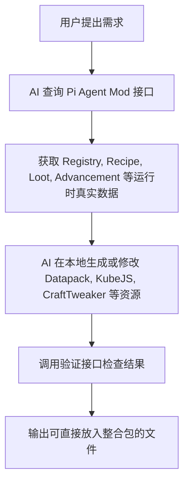

# 01. Pi Agent Mod - 架构概述

**Pi Agent Mod** 是一个专门为 AI 辅助 Minecraft 开发而设计的 NeoForge 开发工具，而不是一个普通的游戏内容 Mod。

它的目标是成为 **Minecraft 运行时（Runtime）的统一数据访问层**，为 AI Agent 提供准确、实时、可编程的游戏信息，使 AI 不再依赖解析 Mod JAR、资源包或猜测 JSON 结构，而是直接从游戏运行时获取最终结果。

---

## 1. 核心设计哲学与角色分工

在传统的整合包或 Mod 开发中，AI 难以直接编写出 100% 正确的配置文件或脚本，因为 Minecraft 拥有极其复杂的动态运行时数据。为了解决这一痛点，我们明确了以下角色分工：

```
┌──────────────────────────────────────┐
│     VSCode / Codex / Claude Code     │ (AI 客户端 / 智能体环境)
└──────────────────┬───────────────────┘
                   │
                   │ MCP (Model Context Protocol) / HTTP API / WebSocket
                   ▼
┌──────────────────────────────────────┐
│             Pi Agent Mod             │ (运行于 Minecraft 内的开发工具)
└──────────────────┬───────────────────┘
                   │ 读取 (Java API)
                   ▼
┌──────────────────────────────────────┐
│          Minecraft Runtime           │ (游戏运行时：Registry, RecipeManager...)
└──────────────────────────────────────┘
```

### 1.1. 核心职责
Pi Agent Mod 负责向外部 AI 工具暴露标准化接口（支持 MCP、HTTP 或 WebSocket），提供 Minecraft 当前运行环境中的**真实数据**。所有返回的数据均应代表 Minecraft 当前运行时的**最终状态**，而不是静态资源文件。数据范围包括但不限于：
* **Registry**（物品、方块、生物、流体、药水、维度、生物群系等）
* **RecipeManager**（所有配方，包括 Mod、KubeJS、CraftTweaker、Datapack 修改后的最终结果）
* **Loot Tables**（战利品表）
* **Advancement**（成就）
* **Tags**（物品标签、方块标签等）
* **Attributes**（属性）
* **Damage Types**
* **Enchantments**
* **Villager Trades**
* 世界状态（可选）
* 玩家状态（可选）

### 1.2. AI 的职责
AI 不直接在游戏内操作 Minecraft Runtime。AI 应当：
1. **查询**游戏运行时数据。
2. **理解**用户需求。
3. **在本地生成或修改** Datapack、KubeJS、CraftTweaker、配置文件等开发资源。
4. 必要时**调用** Pi Agent Mod 的验证接口检查生成结果是否正确。

> [!IMPORTANT]
> **Pi Agent Mod 不负责生成内容，而是提供真实、可靠的数据来源。**

---

## 2. 设计原则

* **Runtime First**：所有数据优先来自运行时 Registry，而不是解析 Jar 包。
* **Read First**：默认提供查询与导出能力，不主动修改游戏内容。
* **Stable API**：尽量保持接口稳定，不暴露 Minecraft 内部不必要的实现细节。
* **Version Friendly**：兼容不同 Minecraft/NeoForge 版本，减少 AI 对版本差异的关注。
* **Machine Readable**：所有接口优先返回结构化数据（JSON 或等效格式）。
* **AI Friendly**：接口命名清晰、语义明确，避免要求 AI 理解复杂的 Minecraft 内部结构。

---

## 3. 模块结构设计 (`pi-agent`)

项目结构采用高度模块化的设计：

```
pi-agent/
├── agent-core          // 生命周期、配置管理、设计原则基类、公共工具与线程安全工具
├── registry-service    // 游戏注册表（Registry）查询服务（方块、物品、流体、维度、生物群系等）
├── recipe-service      // 配方（RecipeManager）查询服务（包含 KubeJS/CraftTweaker 的最终修改结果）
├── loot-service        // 战利品表（LootDataManager）查询服务
├── advancement-service // 进度（Advancement）查询服务
├── event-service       // 游戏事件订阅与监听服务（如配方重载、聊天消息、世界状态等）
├── http-api            // HTTP 接口、MCP 协议与 WebSocket 协议实现
├── export-service      // 导出服务（将运行时数据批量导出为 JSON 缓存以供 AI 本地快速读取）
└── debug-tools         // 调试命令注册、性能分析与状态监控
```

---

## 4. 推荐工作流程



1. **用户提出需求**：例如“我想修改绿宝石的合成表和村民交易”。
2. **AI 查询接口**：通过 MCP 或 HTTP 从 Pi Agent Mod 中查询绿宝石的现有配方、标签和村民交易列表（`Villager Trades`）。
3. **获取真实数据**：Pi Agent Mod 返回经过游戏内所有 Mod 动态处理后的最终真实数据。
4. **本地生成/修改**：AI 在本地的 `kubejs/`、`scripts/`（CraftTweaker）或 `datapacks/` 目录下生成对应的脚本或 JSON 配置文件。
5. **调用验证接口**：AI 发送重载命令，重新查询接口以校验改动是否正确加载。
6. **输出结果**：将生成完成的文件发布到整合包或 Mod 项目中。

---

## 5. 关键技术选型 (基于 NeoForge 26.2 / Minecraft 1.21.4)

1. **开发平台与依赖**：
   * **NeoForge 26.2**：适用于 Minecraft 1.21.4 及以上版本，支持 **Java 25**。
   * 使用 Java 25 的全新特性（如 Virtual Threads, Pattern Matching, Records）可以使网络服务和 JSON 解析编写得更加简洁、高效。
2. **轻量级 Web 服务器**：
   * 推荐使用 Java 25 自带的 `com.sun.net.httpserver.HttpServer`，或者轻量级的 `Javalin` / `Netty`。
3. **JSON 序列化**：
   * 优先利用现有的 Codec 将游戏内对象序列化为 JsonElement，以确保格式和官方完全一致。

---

## 6. 最终目标

Pi Agent Mod 希望成为 **Minecraft AI 开发生态的统一 Runtime SDK**，使 AI 能够像调用数据库或 Web API 一样访问 Minecraft 的运行时数据，从而实现更加准确、稳定、高效的整合包开发、Mod 开发和自动化内容生成。
